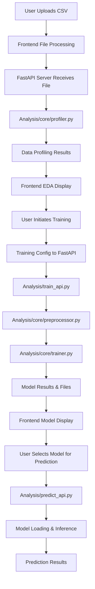

# AutoQuanta Architecture & Implementation Flow

## System Overview

AutoQuanta is a local-first ML application with a **React frontend** and **Python backend** that provides end-to-end machine learning capabilities for tabular data.

```
┌─────────────────┐    HTTP/REST    ┌─────────────────┐
│   React Frontend│ ←──────────────→ │  FastAPI Backend│
│   (Next.js)     │                 │   (Python)      │
└─────────────────┘                 └─────────────────┘
         │                                   │
         ▼                                   ▼
┌─────────────────┐                 ┌─────────────────┐
│   localStorage  │                 │  Analysis/      │
│   (UI State)    │                 │  (ML Engine)    │
└─────────────────┘                 └─────────────────┘
```

---

## 1. PROJECT STRUCTURE

```
AutoQuanta/
├── frontend/                      # React/Next.js Frontend
│   ├── src/
│   │   ├── app/                   # Next.js App Router Pages
│   │   │   ├── page.tsx           # Home/Landing
│   │   │   ├── project/page.tsx   # Project Management
│   │   │   ├── eda/page.tsx       # Data Analysis
│   │   │   ├── train/page.tsx     # Model Training
│   │   │   ├── predict/page.tsx   # Predictions
│   │   │   └── models/page.tsx    # Model Management
│   │   ├── components/            # Reusable UI Components
│   │   ├── store/                 # Redux State Management
│   │   └── lib/                   # Utilities & API Layer
│   └── package.json
├── Analysis/                      # Python ML Engine
│   ├── core/                      # Core ML Components
│   │   ├── trainer.py             # Model Training Engine
│   │   ├── preprocessor.py        # Data Preprocessing
│   │   ├── profiler.py            # Data Analysis
│   │   └── exporter.py            # Model Export
│   ├── utils/                     # Data Structures & Utilities
│   ├── train_api.py               # Training API Bridge
│   └── predict_api.py             # Prediction API Bridge
├── fastapi_server.py              # HTTP API Server
└── projects/                      # Project Storage
```

---

## 2. COMPLETE DATA FLOW

### **A. User Workflow Journey**

```
1. CREATE PROJECT → 2. UPLOAD CSV → 3. ANALYZE DATA → 4. TRAIN MODELS → 5. MAKE PREDICTIONS
      │                    │              │               │                │
      ▼                    ▼              ▼               ▼                ▼
  Project Setup       File Upload    EDA Analysis    Model Training   Inference
```

### **B. Technical Implementation Flow**



---

## 3. FRONTEND ARCHITECTURE

### **A. Technology Stack**
- **Framework**: Next.js 15 (React 19)
- **State Management**: Redux Toolkit
- **Styling**: Tailwind CSS
- **UI Components**: Custom + Radix UI
- **File System**: File System Access API (browser) / Tauri (desktop)

### **B. Page-Level Components**

#### **1. Project Management (`frontend/src/app/project/page.tsx`)**
```typescript
Features:
- Project creation with directory selection
- Project listing and management
- Integration with localStorage for persistence
- Directory picker using File System Access API

Key Functions:
- handleSelectProjectDirectory() → calls tauriAPI.selectDirectory()
- Project CRUD operations
- localStorage project persistence
```

#### **2. Data Analysis (`frontend/src/app/eda/page.tsx`)**
```typescript
Features:
- CSV file upload and validation
- Automatic data profiling
- Interactive visualizations
- Data quality reporting

Data Flow:
CSV Upload → FileUpload Component → FastAPI /profile → Analysis/core/profiler.py → Results Display
```

#### **3. Model Training (`frontend/src/app/train/page.tsx`)**
```typescript
Features:
- Training configuration interface
- Real-time training progress
- Model comparison and selection
- Model export to directories

Key Components:
- TrainingConfig: Algorithm selection, hyperparameters
- TrainingProgress: Real-time updates via WebSocket-like progress
- TrainingResults: Model comparison table
- ModelDetailsModal: Export functionality
```

#### **4. Predictions (`frontend/src/app/predict/page.tsx`)**
```typescript
Features:
- Model selection from saved models
- CSV batch prediction
- Single value prediction
- Results visualization and export

Integration:
- Loads models from localStorage index
- Calls FastAPI /predict endpoint
- Displays results with download options
```

### **C. State Management (Redux)**

#### **Store Structure (`frontend/src/store/`)**
```typescript
store/
├── slices/
│   ├── dataSlice.ts        # CSV data and profiling state
│   ├── projectSlice.ts     # Project management state
│   ├── trainingSlice.ts    # Training progress and results
│   └── predictionSlice.ts  # Prediction state and results
└── hooks.ts               # Typed Redux hooks
```

#### **Key State Flows**
1. **Data Flow**: File upload → dataSlice → profiling results
2. **Training Flow**: Config → trainingSlice → progress → results
3. **Project Flow**: Creation → projectSlice → localStorage sync
4. **Prediction Flow**: Model selection → predictionSlice → results

### **D. API Integration Layer (`frontend/src/lib/tauri.ts`)**

This is the **critical integration layer** that handles:

```typescript
Key Functions:
- selectDirectory(): Native/browser directory selection
- startTraining(): Training API calls with progress handling
- loadAvailableModels(): Model discovery and loading
- makePrediction(): Prediction API calls
- exportModelToDirectory(): Model export with file system integration

Dual Mode Support:
- Browser Mode: File System Access API, localStorage fallbacks
- Desktop Mode: Native Tauri API calls (future)
```

---

## 4. BACKEND ARCHITECTURE

### **A. FastAPI Server (`fastapi_server.py`)**

**Central HTTP API** that bridges frontend and Python ML engine:

```python
Key Endpoints:
├── POST /train              # Model training
├── GET  /models             # List available models
├── POST /predict            # Batch predictions
├── POST /predict_single     # Single predictions
├── POST /profile            # Data profiling
├── GET  /projects           # Project management
└── GET  /health             # System health check

Architecture Pattern:
Frontend Request → FastAPI Validation → Python Script Execution → JSON Response
```

#### **Critical Implementation Details**

**1. Training Endpoint (`/train`)**
```python
Flow:
1. Receives CSV file + training config JSON
2. Creates temporary CSV file
3. Executes subprocess: python Analysis/train_api.py <csv> <config>
4. Parses JSON output from training script
5. Returns structured training results

Error Handling:
- Subprocess timeouts (5 minutes)
- JSON parsing with progress filtering
- Temporary file cleanup
```

**2. Model Discovery (`/models`)**
```python
Flow:
1. Executes: python Analysis/predict_api.py list_models
2. Scans file system for saved models
3. Returns model metadata and capabilities
```

### **B. ML Engine (`Analysis/` Directory)**

#### **1. Training API Bridge (`Analysis/train_api.py`)**
```python
Purpose: Command-line interface for model training
Input: CSV file path + JSON config
Output: JSON training results

Key Functions:
- emit_progress(): Real-time progress updates to frontend
- serialize_training_results(): Convert sklearn objects to JSON
- Integration with Analysis.core.trainer module

Data Flow:
CSV → AutoPreprocessor → ModelTrainer → TrainingResults → JSON serialization
```

#### **2. Core Preprocessing (`Analysis/core/preprocessor.py`)**

**Most sophisticated component** - handles all data preparation:

```python
AutoPreprocessor Class:
├── Outlier Detection & Handling
│   ├── IQR Method (threshold: 1.5)
│   ├── Z-Score Method (threshold: 3.0)
│   └── Strategies: clip, remove, transform
├── Missing Value Handling
│   ├── Numeric: median imputation
│   └── Categorical: constant imputation
├── Feature Scaling
│   ├── StandardScaler (z-score normalization)
│   ├── MinMaxScaler (0-1 scaling)
│   └── RobustScaler (median-based)
├── Categorical Encoding
│   ├── OneHotEncoder (default)
│   ├── TargetEncoder (mean target encoding)
│   ├── OrdinalEncoder (integer mapping)
│   └── FrequencyEncoder (count-based)
└── Feature Engineering
    ├── ID column detection and removal
    ├── High cardinality filtering
    └── Data type optimization

Pipeline Order:
Raw Data → Outlier Handling → Missing Values → Scaling → Encoding → ML Ready
```

#### **3. Model Training Engine (`Analysis/core/trainer.py`)**
```python
ModelTrainer Class:
├── Supported Algorithms
│   ├── RandomForest (Classification/Regression)
│   ├── LightGBM (Gradient Boosting)
│   └── XGBoost (Extreme Gradient Boosting)
├── Cross-Validation Strategy
│   ├── StratifiedKFold (classification)
│   └── KFold (regression)
├── Hyperparameter Optimization
│   ├── RandomizedSearchCV
│   └── Predefined parameter grids
└── Model Evaluation
    ├── Multiple metrics per task type
    ├── Feature importance calculation
    └── Cross-validation scoring

Training Flow:
Preprocessed Data → Algorithm Training → Cross-Validation → Hyperparameter Tuning → Best Model Selection
```

#### **4. Data Profiling (`Analysis/core/profiler.py`)**
```python
DataProfiler Class:
├── Basic Statistics
│   ├── Shape, memory usage
│   ├── Missing value analysis
│   └── Data type detection
├── Column-Level Analysis
│   ├── Numeric: mean, std, min, max, outliers
│   ├── Categorical: cardinality, frequency distribution
│   └── Data quality warnings
├── Visualization Data Generation
│   ├── Histogram data for numeric columns
│   ├── Bar chart data for categorical columns
│   └── Correlation matrix for numeric features
└── Recommendations
    ├── Preprocessing suggestions
    ├── Feature engineering opportunities
    └── Data quality improvements

Output: Structured profile for frontend visualization
```

---

## 5. DATA STORAGE & PERSISTENCE

### **A. Frontend Storage (localStorage)**
```typescript
Storage Keys:
├── autoquanta_projects                    # Project index
├── autoquanta_project_models_{id}         # Project model index
├── autoquanta_project_results_{id}        # Project training results
├── autoquanta_model_{project}_{model}     # Individual model metadata
├── currentProjectDirectory                # Active project directory
└── trained_models                         # Global model fallback

Data Structure Example:
{
  "id": "project_123",
  "name": "Customer Analysis",
  "directory": "/Users/user/ML Projects/customer-analysis",
  "created_at": "2025-01-15T10:30:00Z",
  "models": [
    {
      "id": "model_456",
      "name": "Random Forest Classifier",
      "score": 0.89,
      "created_at": "2025-01-15T11:00:00Z"
    }
  ]
}
```

### **B. Backend Storage (File System)**
```
Project Directory Structure:
/Users/user/ML Projects/customer-analysis/
├── data/
│   └── original_dataset.csv
├── models/
│   ├── random_forest_20250115/
│   │   ├── model.pkl                    # Serialized sklearn model
│   │   ├── preprocessor.pkl             # Fitted preprocessor
│   │   ├── metadata.json                # Model metadata
│   │   └── feature_names.json           # Feature mapping
│   └── xgboost_20250115/
└── results/
    ├── training_results_20250115.json   # Training session results
    └── predictions_20250115.csv         # Prediction outputs
```

---

## 6. KEY INTEGRATION POINTS

### **A. Frontend ↔ Backend Communication**

**1. Training Flow**
```typescript
Frontend (train/page.tsx):
1. TrainingConfig component collects parameters
2. useAppDispatch(startTraining(config, dataset))
3. trainingSlice calls tauriAPI.startTraining()
4. tauriAPI makes HTTP POST to /train
5. FastAPI executes train_api.py subprocess
6. Progress updates streamed back to frontend
7. Final results update Redux store
```

**2. Model Management**
```typescript
Frontend (models/page.tsx):
1. Component mounts → useEffect calls loadAvailableModels()
2. tauriAPI.loadAvailableModels() → HTTP GET /models
3. FastAPI executes predict_api.py list_models
4. Model list returned → Redux store → UI display
5. Export button → ModelDetailsModal → directory selection → file system save
```

### **B. Data Flow Synchronization**

**Critical Integration:** Frontend and backend maintain model consistency through:

1. **Model Registration**: Training results automatically create localStorage entries
2. **Directory Synchronization**: Project directories bridge localStorage and file system
3. **Model Discovery**: Backend scans file system, frontend indexes in localStorage
4. **State Persistence**: Redux state hydrates from localStorage on app load

### **C. Error Handling & Resilience**

**Frontend Fallbacks:**
- File System Access API → Alert for unsupported browsers
- FastAPI server down → localStorage model discovery
- Training failures → Error display with retry options

**Backend Robustness:**
- Subprocess timeouts prevent hanging
- Temporary file cleanup on errors
- JSON parsing with progress message filtering
- CORS configuration for frontend communication

---

## 7. PREPROCESSING PIPELINE DETAILS

### **A. Pipeline Architecture**
```python
sklearn.pipeline.Pipeline([
    ('drop_cols', DropColumnsTransformer),      # Remove ID columns
    ('preprocess', ColumnTransformer([
        ('num', Pipeline([
            ('outlier_handler', OutlierHandler),    # Outlier detection/handling
            ('imputer', SimpleImputer),             # Missing value imputation
            ('scaler', StandardScaler)              # Feature scaling
        ]), numeric_columns),
        ('cat', Pipeline([
            ('imputer', SimpleImputer),             # Missing category handling
            ('encoder', OneHotEncoder)              # Categorical encoding
        ]), categorical_columns)
    ]))
])
```

### **B. Custom Transformers**

**1. OutlierHandler**
```python
Methods: 'iqr', 'zscore'
Strategies: 'clip', 'remove', 'transform'
Features:
- Automatic threshold detection
- Per-column outlier statistics
- Integration with sklearn Pipeline
```

**2. TargetEncoder**
```python
Features:
- Smoothing to prevent overfitting
- Handles unseen categories
- Cross-validation safe implementation
```

**3. Advanced Categorical Encoders**
```python
Encoding Options:
- OneHot: Low cardinality, tree models
- Target: High cardinality, correlation-based
- Ordinal: Natural ordering, memory efficient
- Frequency: Count-based importance
```

---

## 8. MODEL TRAINING & EVALUATION

### **A. Training Configuration**
```python
TrainingConfig:
├── Dataset Configuration
│   ├── target_column: str
│   ├── task_type: 'classification' | 'regression'
│   └── validation_strategy: 'cv' | 'holdout'
├── Preprocessing Options
│   ├── scaling_strategy: 'standard' | 'minmax' | 'robust'
│   ├── categorical_encoding: 'onehot' | 'target' | 'ordinal'
│   ├── handle_outliers: bool
│   └── outlier_method: 'iqr' | 'zscore'
├── Model Selection
│   ├── algorithms: List['rf', 'lgb', 'xgb']
│   ├── cv_folds: int
│   └── random_state: int
└── Hyperparameter Tuning
    ├── n_iter: int
    └── scoring: str
```

### **B. Training Execution Flow**
```python
1. Data Validation & Profiling
2. Preprocessing Pipeline Fitting
3. Train-Test Split (if holdout)
4. For each algorithm:
   a. Cross-validation training
   b. Hyperparameter optimization
   c. Performance evaluation
   d. Feature importance calculation
5. Best Model Selection
6. Final Model Training on full dataset
7. Model Serialization & Metadata Storage
8. Results Packaging for Frontend
```

### **C. Model Evaluation Metrics**

**Classification:**
- Accuracy, Precision, Recall, F1-Score
- ROC-AUC (binary classification)
- Cross-validation scores with std deviation

**Regression:**
- Mean Squared Error (MSE)
- Mean Absolute Error (MAE)
- R² Score
- Cross-validation scores with std deviation

---

## 9. PREDICTION & INFERENCE

### **A. Model Loading Pipeline**
```python
1. Model Discovery (predict_api.py list_models):
   - Scan project directories for model files
   - Load metadata.json for each model
   - Return model capabilities and paths

2. Model Loading for Inference:
   - Load serialized sklearn model (.pkl)
   - Load fitted preprocessor (.pkl)
   - Load feature names and metadata
   - Validate model compatibility
```

### **B. Prediction Flow**
```python
Input Data → Preprocessing (same pipeline as training) → Model Inference → Results

Steps:
1. CSV/Single Value Input Validation
2. Feature Name Alignment
3. Preprocessing Pipeline Transform
4. Model.predict() or Model.predict_proba()
5. Result Post-processing (inverse transforms if needed)
6. JSON Response with predictions + metadata
```

### **C. Frontend Prediction Interface**
```typescript
Components:
├── ModelSelectionModal: Choose from available models
├── CSVValidator: Validate input data format
├── PredictionProgress: Real-time inference status
└── PredictionResults: Display results with export options

Integration:
- Redux state management for prediction flow
- File upload for batch predictions
- Form inputs for single predictions
- Results export to CSV/JSON
```

---

## 10. PROJECT MANAGEMENT & FILE SYSTEM

### **A. Directory Structure Philosophy**
```
Unified Project Directory:
- ONE directory selected by user
- ALL project data stored within
- Models, datasets, results co-located
- Easy backup and sharing
```

### **B. File System Integration**

**Browser Mode:**
```typescript
File System Access API:
- showDirectoryPicker() for native directory selection
- Directory handles stored in globalThis
- Fallback alerts for unsupported browsers
```

**Desktop Mode (Future Tauri):**
```rust
Native File System:
- OS-native directory dialogs
- Full file system access
- No browser security restrictions
```

### **C. Project Lifecycle**
```typescript
1. Project Creation:
   - User selects directory via native picker
   - Project metadata created in localStorage
   - Directory path stored for future operations

2. Data Operations:
   - CSV uploads processed and analyzed
   - Training results saved to project directory
   - Models exported to project/models/

3. Project Persistence:
   - localStorage maintains project index
   - File system contains actual data/models
   - Sync between localStorage and disk
```

---

## 11. PERFORMANCE & SCALABILITY

### **A. Frontend Performance**
- **Lazy Loading**: Pages loaded on-demand via Next.js App Router
- **State Optimization**: Redux slices minimize re-renders
- **File Streaming**: Large CSV processing with progress indicators
- **Caching**: localStorage caches model metadata and project info

### **B. Backend Performance**
- **Subprocess Isolation**: Python ML scripts run in separate processes
- **Memory Management**: Temporary files cleaned up automatically
- **Timeout Handling**: 5-minute training timeout prevents hanging
- **Concurrent Requests**: FastAPI async support for multiple operations

### **C. Scalability Considerations**
- **Model Storage**: File-based storage scales with disk space
- **Training Parallelization**: sklearn n_jobs=-1 uses all CPU cores
- **Memory Efficiency**: Streaming CSV processing for large datasets
- **Project Isolation**: Each project in separate directory

---

## 12. SECURITY & PRIVACY

### **A. Local-First Architecture**
- **No Cloud Dependencies**: All processing happens locally
- **Data Privacy**: User data never leaves their machine
- **Offline Capable**: Fully functional without internet

### **B. File System Security**
- **User Permission**: Directory selection requires explicit user consent
- **Sandbox Restrictions**: Browser File System Access API provides security
- **Path Validation**: Backend validates file paths and extensions

### **C. Code Security**
- **Input Validation**: All user inputs validated before processing
- **Subprocess Safety**: Python scripts executed with controlled parameters
- **Error Handling**: Graceful failure without exposing system internals

---

## 13. FUTURE ARCHITECTURE CONSIDERATIONS

### **A. Desktop App Migration (Tauri)**
```rust
Current web app ready for Tauri integration:
- tauriAPI.ts already has desktop mode detection
- Native file system calls prepared
- LocalStorage can be replaced with Tauri stores
```

### **B. ML Pipeline Extensions**
```python
Planned enhancements:
- Deep Learning models (TensorFlow/PyTorch)
- AutoML capabilities (auto-sklearn, FLAML)
- Feature selection algorithms
- Model interpretation tools (SHAP, LIME)
```

### **C. Collaboration Features**
```
Future multi-user capabilities:
- Project sharing and versioning
- Model registry and lineage tracking
- Experiment tracking and comparison
- Team collaboration tools
```

---

## 14. DEVELOPMENT & DEBUGGING

### **A. Key Development Tools**
- **Frontend**: Next.js DevTools, Redux DevTools, React Developer Tools
- **Backend**: FastAPI automatic docs at `/docs`, Python logging
- **Integration**: Browser Network tab, FastAPI request logs

### **B. Common Integration Points to Monitor**
1. **File System Access**: Browser compatibility and user permissions
2. **FastAPI Communication**: CORS, request/response formatting
3. **Subprocess Execution**: Python script errors and timeouts
4. **State Synchronization**: localStorage ↔ Redux ↔ File system

### **C. Error Debugging Strategy**
1. **Frontend Errors**: Redux DevTools + Browser Console
2. **API Errors**: FastAPI logs + Network tab
3. **ML Errors**: Python script stdout/stderr in FastAPI response
4. **File System Errors**: Check directory permissions and paths

---

This architecture provides a **robust, scalable, and maintainable** foundation for local-first machine learning applications with clear separation of concerns and well-defined integration points.